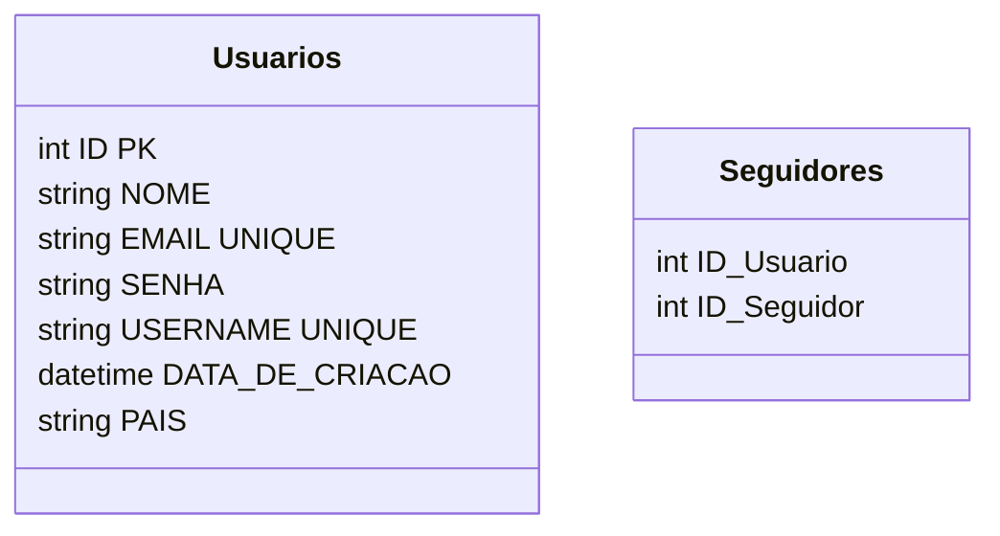

# Postgress SQL

# MongoDB

class Posts {
    string Id
    int id_usuario
    string[] foto_url
    string foto_comentario
    string comentario
    int curtidas
}

# Cassandra

class posts_curtidos {
    int id_usuario
    string id_post
}

class posts_comentados {
    int id_usuario
    string id_post
}